# 🔐 Token Escrow on Solana (Anchor)

A **simple, secure Token Escrow program** built on **Solana** using the **Anchor framework**.  
This program allows users to **deposit custom SPL tokens into a PDA-controlled vault** and **withdraw them only via program logic**, ensuring trustless custody.

This project is designed as a **learning-first, production-aligned implementation** of how real Solana escrow systems work.

  

## 🚀 What This Project Does

* ✅ **Secure Storage:** Stores custom SPL tokens in a vault.
* ✅ **PDA Ownership:** The Vault is owned by a **Program Derived Address (PDA)** — not a user.
* ✅ **Deposit:** Users can deposit tokens into the escrow vault.
* ✅ **Conditional Withdrawal:** Tokens can be withdrawn *only* by program logic (no backdoors).
* ✅ **Universal:** Works with *any* custom SPL token mint.
* ✅ **Tested:** Built using **Anchor (Rust)** + **TypeScript integration tests**.

---

## 🧠 Why Escrow?

In Web3, **trustless custody** is the most critical primitive.

* **Without an Escrow:** Tokens are controlled by private keys. If you send tokens to someone, you have to trust them to send them back or perform the service.
* **With an Escrow:** Tokens are controlled by **on-chain logic**. No single user can steal funds. The program acts as a neutral third party that enforces the rules.

This pattern is the foundation for NFT Marketplaces, Staking contracts, DeFi protocols, and Game economies.

---

## 🏗️ Architecture Overview

### Core Components

| Component | Description |
| :--- | :--- |
| **Program** | The Anchor-based Smart Contract |
| **Vault PDA** | The Program-Derived Authority (The "Owner") |
| **Vault Token Account** | The actual account holding the locked tokens |
| **User Token Account** | The user’s wallet token account |
| **Mint** | The custom SPL token being used |

### PDA Design

We use a deterministic seed pattern to ensure safety:

> **Vault Authority Seeds** = `["vault", mint_pubkey]`

* The PDA owns the vault token account.
* Only the program can sign for this PDA.
* Users cannot withdraw directly; they must call the program's instruction.

### Architecture Flow

```mermaid
graph TD
    User["👤 User"]
    Program["⚙️ Escrow Program"]
    VaultPDA["🔐 Vault PDA (Authority)"]
    VaultATA["💰 Vault Token Account"]
    
    subgraph Initialization
    Program -- Derives --> VaultPDA
    Program -- Creates --> VaultATA
    end
    
    subgraph Deposit
    User -- Transfers Tokens --> VaultATA
    end
    
    subgraph Withdraw
    Program -- Signs via PDA --> VaultATA
    VaultATA -- Transfers Tokens --> User
    end
```



---

## 🔁 How It Works

### 1️⃣ Initialize
* The program derives the **Vault PDA**.
* It initializes a new **Vault Token Account** owned by that PDA.

### 2️⃣ Deposit
* The user calls the `deposit` instruction.
* Tokens are transferred from `User Token Account` → `Vault Token Account`.
* *Result:* Funds are now locked in escrow.

### 3️⃣ Withdraw
* The program verifies the withdrawal conditions are met.
* The Program "signs" the transaction using the PDA seeds.
* Tokens are transferred from `Vault Token Account` → `User Token Account`.

---

## 🛠️ Tech Stack

* **Solana Blockchain**
* **Anchor Framework** (v0.32+)
* **Rust** (Smart Contract Logic)
* **TypeScript** (Tests & Client)
* **@solana/web3.js**
* **@solana/spl-token**

---

## 🧪 Testing

The project includes a robust TypeScript test suite executed via Anchor.

### Test Coverage
1.  **PDA Derivation:** Ensures the Vault address is generated correctly.
2.  **Minting:** Creates a fresh SPL Token Mint for testing.
3.  **Deposit:** Verifies tokens actually leave the user wallet and enter the vault.
4.  **Balance Checks:** Logs and asserts token balances on-chain.

### Run Tests

```bash
anchor test
```
> ⚠️ **Note:** Ensure your local validator is running or configured correctly in `Anchor.toml`.

---

## 🔒 Security Notes

* **No Private Keys:** The vault is owned by a PDA. No human possesses a private key that can move these funds.
* **Program Enforcement:** Withdrawals require a specific instruction signed by the program.
* **Anti-Spoofing:** We use canonical bumps and seed constraints to prevent fake accounts from being used.

---

## 🧩 Learning Outcomes

By building and using this project, you learn:
* **PDA Management**: How to programmatically own assets.
* **CPI (Cross-Program Invocations)**: How to call the Token Program from your code.
* **Anchor Constraints**: How to secure accounts (`mut`, `seeds`, `token::authority`).
* **Escrow Patterns**: The fundamental building block of DeFi.

---

## 🚧 Future Improvements
* 🔐 **Admin Control:** Add an admin key that can freeze or recover funds in emergencies.
* 🌐 **Frontend:** Connect a React UI using Solana Wallet Adapter.

---


